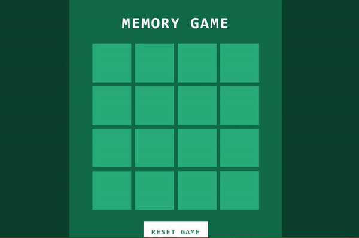

# Memory Game

Memory Game is a simple web-based game built using HTML, CSS, and JavaScript. The objective of the game is to match pairs of emojis by clicking on the tiles.

## How to Play
-  Open the index.html file in a web browser.
-  The game board will be displayed, consisting of a grid of tiles with emojis on them.
-  Click on a tile to reveal the emoji underneath.
-  Try to find the matching emoji by clicking on another tile.
-  If the emojis on the tiles match, both tiles will stay open.
-  If the emojis don't match, the tiles will flip back after a brief moment.
-  Continue revealing tiles and matching pairs until all pairs have been found.
-  Once all pairs are matched, an alert will appear indicating that you've won the game.
-  Resetting the Game
-  If you want to reset the game and play again, you can click the "Reset Game" button located at the bottom of the game interface.

## Technologies Used
-  HTML: Defines the structure of the game board.
-  CSS: Provides styling and layout for the game interface.
-  JavaScript: Implements the game logic, tile matching, and user interactions.

## Game Interface

The game interface consists of a title, the game board, and a reset button. The game board is a grid of tiles, each containing an emoji. When you click on a tile, it flips over to reveal the emoji underneath. The tiles will match if their emojis are the same.

## Styling

The game interface features a responsive design, a colorful background, and clean typography. The design creates an engaging and visually appealing experience for players.

## Developer

This Memory Game was developed by Ashwin. Feel free to reach out to me if you have any questions or suggestions!
